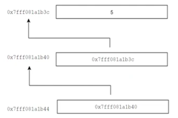

### Pointer Level 2

#### Recall Pointer 1:

- For example:

        
        int value = 5;
        int *pt = &value;
        
    > In this case: `*pt is 5` and `pt is address of "value"`

#### Pointer 2:
- We need to modify value of register that pointer points to \> So we need to use pointer level 2

- Continue the above code:

        **pointer_to_pointer = &pt;
        `pointer_to_pointer points to address of pt`
    

    

- The purposes of a level-2 pointer are:

    1. Modify the value that the pointer points to.

    2. Change the address of the pointer.

`16:50`

